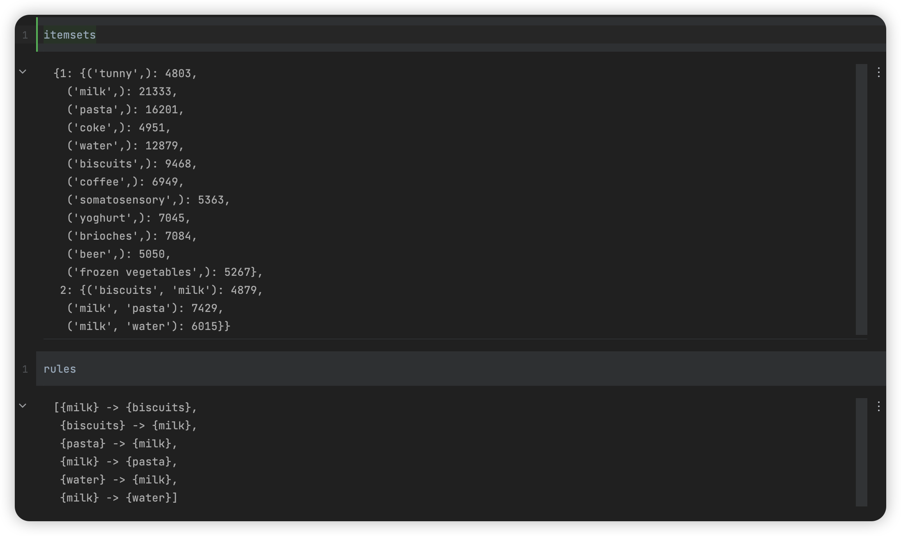

# 数据挖掘：实验十一 关联规则

| 课程 | 数据挖掘   |
| ---- | ---------- |
| 学号 | 32001261   |
| 姓名 | 舒恒鑫     |
| 班级 | 计算机2004 |

## 实验目的和要求

通过在Python中的实例应用，分析掌握利用Apriori算法进行数据挖掘的基本原理，加深对关联规则模型算法的理解，并掌握将算法应用于实际的方法、步骤

## 实验内容和原理

- 通过实际例子理解Apriori算法的基本原理，加深对算法的理解；
- 对Python中Apriori算法的实例数据输出结果进行分析。

## 操作方法和实验步骤

导入数据Transactions.csv(第一行是属性名称，第一列表示流水号)，试给定最小支持度与最小置信度的值，根据https://pypi.org/project/efficient-apriori/，给出Apriori算法生成的关联规则。

## 实验结果和分析

```python
import pandas as pd
import numpy as np

df = pd.read_csv('data/Transactions.csv').iloc[:, 1:]

goods_list = np.array(['pasta', 'milk', 'water', 'biscuits', 'coffee', 'brioches', 'yoghurt', 'frozen vegetables', 'tunny', 'beer', 'somatosensory', 'coke', 'rice', 'juices', 'crackers', 'oil', 'frozen-fish', 'icecream', 'mozzarella', 'tinned-meat'])
transactions_from_df = [tuple(goods_list[row.astype(bool)]) for row in df.values]

from efficient_apriori import apriori

itemsets, rules = apriori(transactions_from_df, min_support=0.1, min_confidence=0.1)
```

