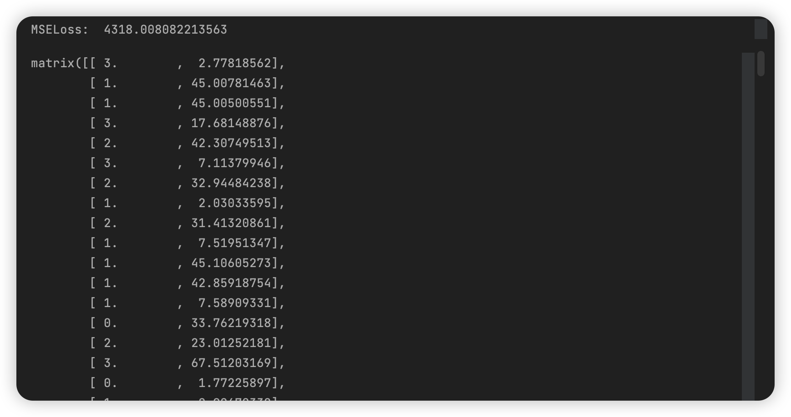
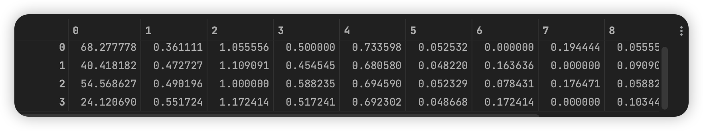
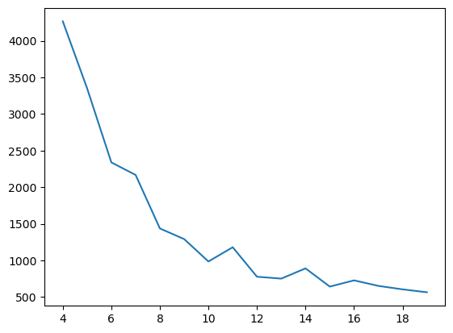
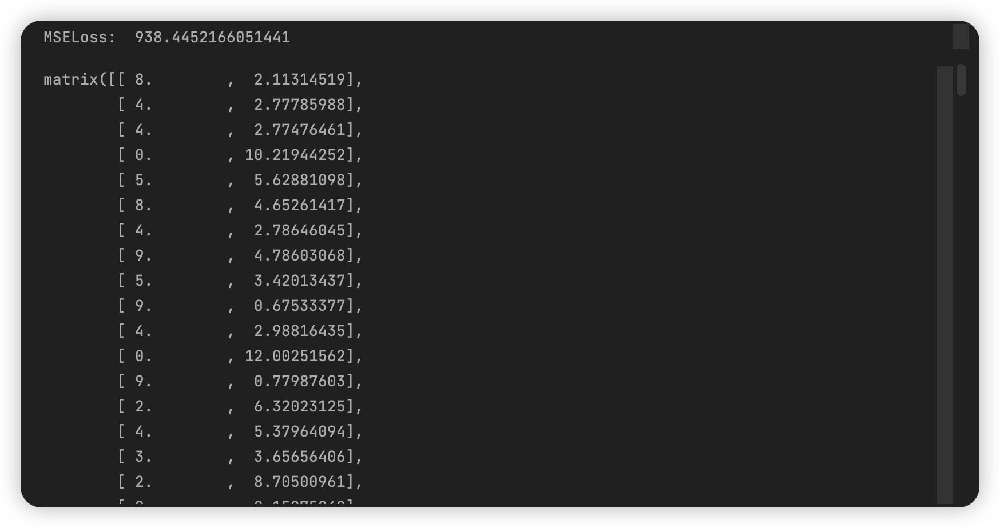
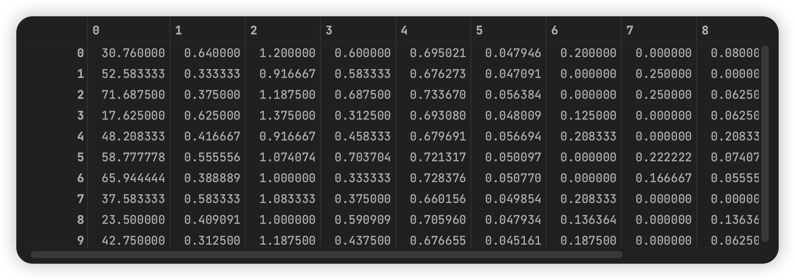

# 数据挖掘：实验十 聚类

| 课程 | 数据挖掘   |
| ---- | ---------- |
| 学号 | 32001261   |
| 姓名 | 舒恒鑫     |
| 班级 | 计算机2004 |

## 实验目的和要求

通过在Python中的实例应用，分析掌握利用K均值算法进行数据挖掘的基本原理，加深对聚类模型算法的理解，并掌握将算法应用于实际的方法、步骤。

## 实验内容和原理

1. 通过实际例子理解K均值算法的基本原理，加深对算法的理解；
2. 在Pytho实现 K均值算法的数据输入、参数设置，对并结果进行分析。

## 操作方法和实验步骤

1.	下载数据DRUG1n.csv，用Python语言实现K-均值算法。
2.	针对不同的K，分别随机选择不同的初始聚类中心，计算聚类结果的代价函数，并给出相对较优的聚类结果。

## 实验结果和分析

```python
# 计算两个向量的欧氏距离
def distance_euclidean(vector_a, vector_b):
    return np.sqrt(np.sum(np.power(vector_a - vector_b, 2)))


# 构建k个初始簇质心
def rand_centroids(data_set, k):
    m = np.shape(data_set)[0]  # 总样本数
    centroids_idx = set()  # 随机样本索引
    while len(centroids_idx) < k:
        rand_j = np.random.randint(m)
        centroids_idx.add(rand_j)
    centroids = data_set[list(centroids_idx)]  # 初始簇质心
    return centroids


# K-均值聚类方法
def k_means(data_set, k):
    m = np.shape(data_set)[0]  # 样本总数
    cluster_result = np.mat(np.zeros((m, 2)))  # 簇分配结果矩阵
    centroids = rand_centroids(data_set, k)  # 构建k个初始随机质心

    cluster_changed = True  # 簇变化标志
    while cluster_changed:
        cluster_changed = False
        for i in range(m):
            min_dist = np.inf  # 样本点离最近质心的距离
            min_idx = -1  # 样本的簇标记
            for j in range(k):
                dist_ij = distance_euclidean(centroids[j, :], data_set[i, :])  # 样本点I到质心J的距离
                if dist_ij < min_dist:
                    min_dist = dist_ij
                    min_idx = j
            if cluster_result[i, 0] != min_idx:
                cluster_changed = True  # 样本点的簇标记发生变化
            cluster_result[i, :] = min_idx, min_dist ** 2  # 簇分配结果矩阵的两列分别为簇标记和误差
        for cent in range(k):  # 更新质心的位置
            centroids[cent, :] = np.mean(data_set[np.nonzero(cluster_result[:, 0].A == cent)[0]], axis=0)
    return centroids, cluster_result
```

**取 k=4 时，得到簇分配结果及簇质心：**





**作 k 在 4 到 20 取值的 loss 图：**



**取第一个拐点 k = 10**：



