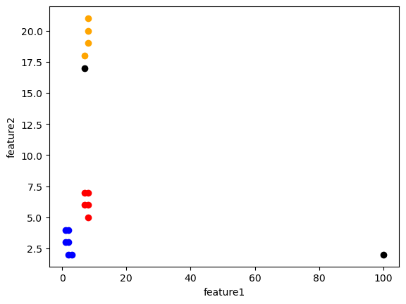
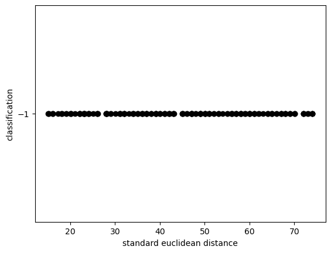
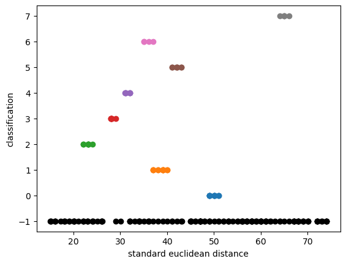
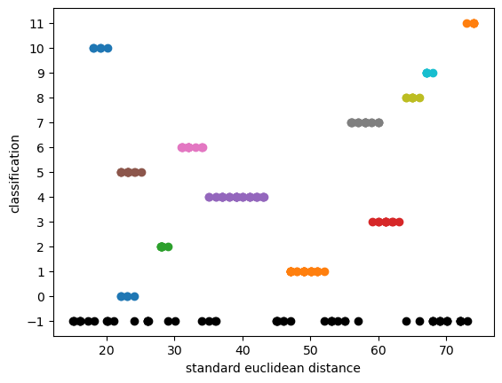
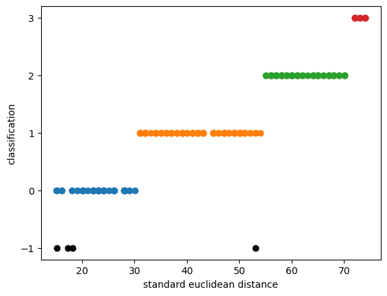

# 数据挖掘：实验十一 聚类续

| 课程 | 数据挖掘   |
| ---- | ---------- |
| 学号 | 32001261   |
| 姓名 | 舒恒鑫     |
| 班级 | 计算机2004 |

## 实验目的和要求

通过在Python中的实例应用，分析掌握利用DBSCAN算法进行数据挖掘的基本原理，加深对聚类模型算法的理解，并掌握将算法应用于实际的方法、步骤。

## 实验内容和原理

- 通过实际例子理解DBSCAN算法的基本原理，加深对算法的理解；
- 在Python中实现DBSCAN算法模型的数据输入、参数设置；
- 对DBSCAN算法的实例数据输出结果进行分析。

## 操作方法和实验步骤

1.	导入数据dbscan_test.csv，在epsilon的值为2.01，minPoints的值为4的情况下确定核心点、边界点以及噪音点。
2.	对数据进行预处理，调用Python的sklearn库中的[DBSCAN模型](https://scikit-learn.org/stable/auto_examples/cluster/plot_dbscan.html#sphx-glr-auto-examples-cluster-plot-dbscan-py)，测试不同的参数对聚类结果的影响，并对数据DRUG1n.csv测试一下聚类结果。

## 实验结果和分析

### dbsanAlgorithm

```python
class DBSCAN:
    def __init__(self, eps, min_p):
        self.eps = eps
        self.min_p = min_p

        self.k = -1
        self.neighbor_list = []  # 用来保存每个数据的邻域
        self.omega_list = []  # 核心对象集合
        self.gama = None  # 初始时将所有点标记为未访问
        self.cluster = None  # 聚类

        self.data = None

    def fit(self, x):
        self.data = x
        return self.find()

    def find(self):
        self.gama = set(range(len(self.data)))
        self.cluster = np.full(len(self.data), -1).tolist()

        for i in range(len(self.data)):
            self.neighbor_list.append(self.find_neighbor(i))
            # 取倒数第一个进行if，如果大于设定的样本数，即为核心点
            if len(self.neighbor_list[-1]) >= self.min_p:
                self.omega_list.append(i)  # 将样本加入核心对象集合
        omega_list = set(self.omega_list)  # 转化为集合便于操作

        while len(omega_list) > 0:
            gama_old = copy.deepcopy(self.gama)
            j = random.choice(list(omega_list))  # 随机选取一个核心对象
            # k计数，从0开始为第一个
            self.k = self.k + 1
            # 初始化Q
            Q = list()
            # 记录访问点
            Q.append(j)
            # 从gama中移除j,剩余未访问点
            self.gama.remove(j)

            while len(Q) > 0:
                # 将第一个点赋值给q,Q队列输出给q,先入先出。
                q = Q[0]
                Q.remove(q)
                if len(self.neighbor_list[q]) >= self.min_p:
                    # &按位与运算符：参与运算的两个值,如果两个相应位都为1,则该位的结果为1,否则为0
                    delta = self.neighbor_list[q] & self.gama
                    delta_list = list(delta)
                    for i in range(len(delta)):
                        # 在Q中增加访问点
                        Q.append(delta_list[i])
                        # 从gama中移除访问点,剩余未访问点
                        self.gama = self.gama - delta
            # 原始未访问点-剩余未访问点=访问点
            Ck = gama_old - self.gama
            Cklist = list(Ck)
            for i in range(len(Ck)):
                # 类型为k
                self.cluster[Cklist[i]] = self.k
            # 剩余核心点
            omega_list = omega_list - Ck
        return np.array(self.cluster)

    def find_neighbor(self, j):
        n = list()
        for i in range(self.data.shape[0]):
            temp = np.sqrt(np.sum(np.square(self.data[j] - self.data[i])))  # 计算欧式距离
            # 如果距离小于eps, 在列表末尾添加新的对象
            if temp <= self.eps:
                n.append(i)
        # 返回邻居的索引
        return set(n)
```




### clusteringByDBSCAN

```
{'algorithm': 'auto',
 'eps': 1,
 'leaf_size': 30,
 'metric': 'euclidean',
 'metric_params': None,
 'min_samples': 5,
 'n_jobs': None,
 'p': None}
```



```
{'algorithm': 'auto',
 'eps': 1.5,
 'leaf_size': 30,
 'metric': 'euclidean',
 'metric_params': None,
 'min_samples': 5,
 'n_jobs': None,
 'p': None}
```



```
{'algorithm': 'auto',
 'eps': 2,
 'leaf_size': 30,
 'metric': 'euclidean',
 'metric_params': None,
 'min_samples': 5,
 'n_jobs': None,
 'p': None}
```



```
{'algorithm': 'auto',
 'eps': 2.1,
 'leaf_size': 30,
 'metric': 'euclidean',
 'metric_params': None,
 'min_samples': 5,
 'n_jobs': None,
 'p': None}
```

