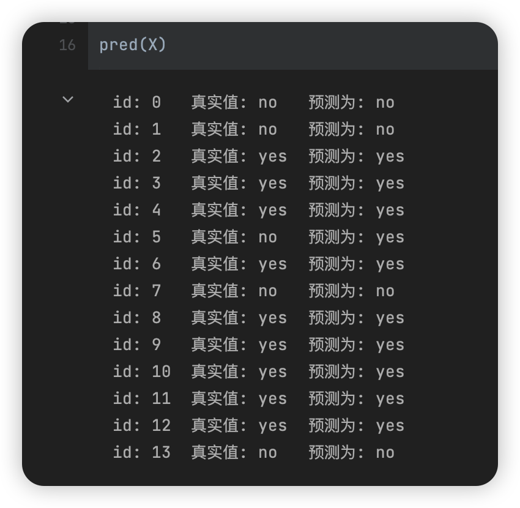

# 数据挖掘：实验五 决策树与朴素贝叶斯网络

| 课程 | 数据挖掘   |
| ---- | ---------- |
| 学号 | 32001261   |
| 姓名 | 舒恒鑫     |
| 班级 | 计算机2004 |

## 实验目的和要求

通过在Python中的实例应用，分析掌握决策树和朴素贝叶斯网络算法进行数据挖掘的基本原理，加深对C4.5算法和朴素贝叶斯网络算法的理解，并掌握将算法应用于实际的方法、步骤。

## 实验内容和原理

1. 在Python中完成C4.5算法模型的数据输入、参数设置；
2. 对Python中C4.5算法的实例数据输出结果进行分析。
3. 在Python中朴素贝叶斯网络算法模型的数据输入、参数设置；
4. 对Python中朴素贝叶斯网络算法的实例数据输出结果进行分析。

## 操作方法和实验步骤

1. 下载数据文件weather_nominal.csv，其最后一列play是目标字段。实现用朴素贝叶斯网络算法进行分类的计算过程。

2. 参考https://scikit-learn.org/stable/modules/tree.html，下载数据文件german_clean.csv(其最后一列class是目标字段)，利用sklearn库中的决策树方法实现以上数据的分类。

## 实验结果和分析

### 朴素贝叶斯分类器

```python
class_count = y[y.columns[0]].value_counts()
class_probability = class_count / len(y)

probability = {}
for _class in y[y.columns[0]].unique():
    for col in X.columns:
        sub_class_count = X[col][y[y.columns[0]] == _class].value_counts()
        for attribute in sub_class_count.index:
            probability[(col, attribute, _class)] = sub_class_count[attribute] / class_count[_class]
```



### 决策树

```python
data = pd.read_csv('data/german_clean.csv')
x = data.iloc[:, :20]
y = data.iloc[:, 20:].to_numpy().flatten()

# 连续数据离散化
continuous_columns = ['duration_new', 'credit_amount', 'age']
transformer = FeatureDiscretization(continuous_columns=continuous_columns)
x = transformer.fit(x, y)

# 训练模型
dt = DecisionTree(criterion='c45')
dt.fit(x.to_numpy(), y)
nodes = dt.level_order(return_node=True)  # 剪枝

dt.score(x.to_numpy(), y)
```


