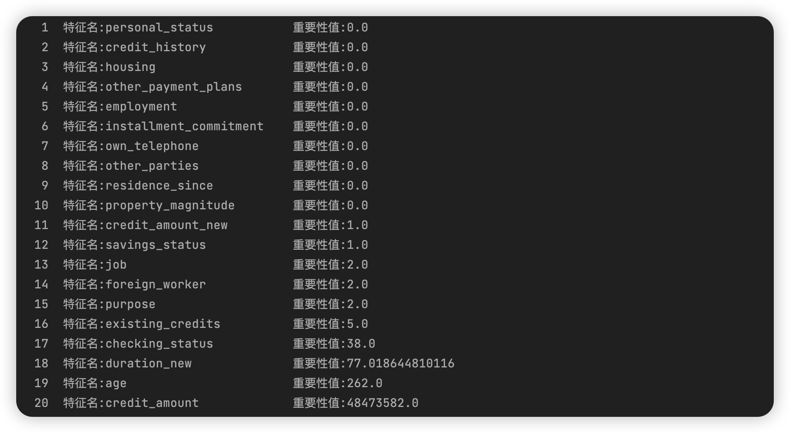

# 数据挖掘：实验九 特征选择

| 课程 | 数据挖掘   |
| ---- | ---------- |
| 学号 | 32001261   |
| 姓名 | 舒恒鑫     |
| 班级 | 计算机2004 |

## 实验目的和要求

通过在Python中的实例应用，分析掌握利用特征选择算法进行数据挖掘的基本原理，加深对特征选择算法的理解，并掌握将算法应用于实际的方法、步骤

## 实验内容和原理

- 通过实际例子理解特征选择算法的基本原理，加深对算法的理解
- 在Python中实现特征选择算法的数据输入、参数设置以及对结果进行分析

## 操作方法和实验步骤

1. 针对数据集german_clean，随机采样100次，利用Relief方法，给出特征重要性程度的排序。
2. 结合第1步得到的特征重要性排序，将数据集的前700个数据作为训练集，后300个数据作为验证集，给出用Logistic回归方法进行分类的最佳特征子集。（注意数据集目标字段的标签是用1,2来表示，要修改成0,1）

## 实验结果和分析

### Answer01

```python
import numpy as np
import pandas as pd

def get_data(dataset):
    new_data = pd.DataFrame()
    for one in dataset.columns[:-1]:
        col = dataset[one]
        if (str(list(col)[0]).split(".")[0]).isdigit() or str(list(col)[0]).isdigit() or \
                (str(list(col)[0]).split('-')[-1]).split(".")[-1].isdigit():
            new_data[one] = dataset[one]
        else:
            keys = list(set(list(col)))
            values = list(range(len(keys)))
            new = dict(zip(keys, values))
            new_data[one] = dataset[one].map(new)
    new_data[dataset.columns[-1]] = dataset[dataset.columns[-1]]
    return new_data


def get_diff(dataset, i, j, mode=None):
    ex_dataset = None
    if mode == 'nh':
        ex_dataset = dataset[dataset[:, -1] == dataset[i][-1]]
    if mode == 'nm':
        ex_dataset = dataset[dataset[:, -1] != dataset[i][-1]]

    dist = np.inf
    for k in range(len(ex_dataset)):
        if k == i:
            continue
        sub = abs(float(ex_dataset[k][j]) - float(dataset[i][j]))
        if sub < dist:
            dist = sub
    return dist


def relief(dataset):
    m, n = dataset.shape
    r = []  # 相关统计量
    for j in range(n - 1):
        rj = 0
        for i in range(m):
            diff_nh = get_diff(dataset, i, j, mode='nh')
            diff_nm = get_diff(dataset, i, j, mode='nm')
            rj += -(diff_nh ** 2) + (diff_nm ** 2)
        r.append(rj)

    return r


if __name__ == '__main__':
    data = pd.read_csv('data/german_clean.csv')

    # 随机采样100次
    feature_list = data.keys()
    new_data = get_data(data)
    np.random.seed(64)
    arr_random = np.random.randint(0, 1000, 100)
    data_random = np.array([new_data.iloc[i, :].to_numpy() for i in arr_random])

    rf = np.array(relief(data_random))
    index = rf.argsort()

    rank = 1
    for i in index:
        print("{:2d}  特征名:{:25} 重要性值:{}".format(rank, np.array(data.keys()[i]), rf[i]))
        rank += 1
```



### Answer02

```python
import numpy as np
import pandas as pd

feature_list = ['credit_amount_new', 'savings_status', 'job', 'foreign_worker', 'purpose', 'existing_credits', 'checking_status', 'duration_new', 'age', 'credit_amount']
data = pd.read_csv('data/german_clean.csv')[feature_list].to_numpy()
target = pd.read_csv('data/german_clean.csv').iloc[:, 20:].to_numpy()

from sklearn.preprocessing import OneHotEncoder

enc = OneHotEncoder(sparse=False)
data = enc.fit_transform(data)

target[target == 1] = 0
target[target == 2] = 1

train_data = data[:700, :]
train_target = target[:700, :]
test_data = data[700:, :]
test_target = target[700:, :]

from sklearn.linear_model import LogisticRegression

reg = LogisticRegression()
reg.fit(train_data, train_target)
reg.score(test_data, test_target)
```

