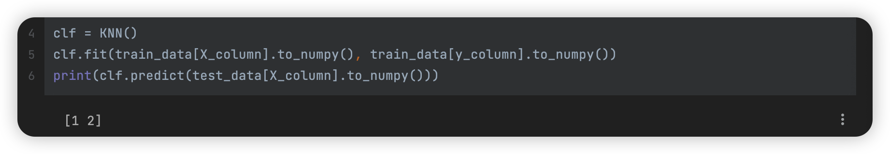
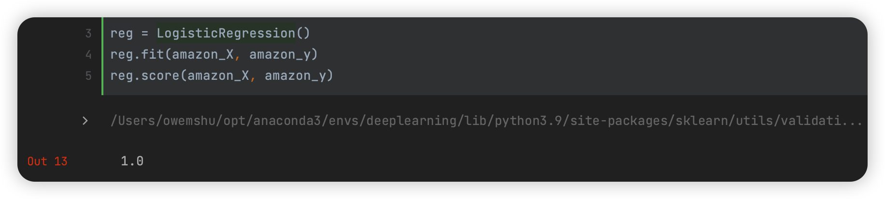
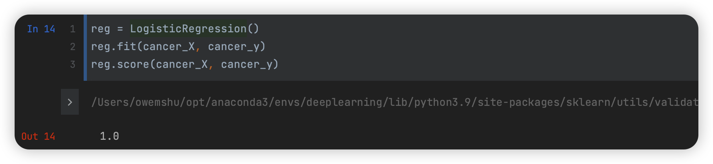
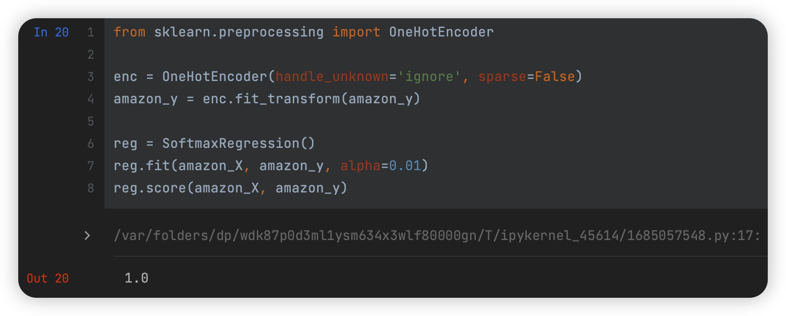
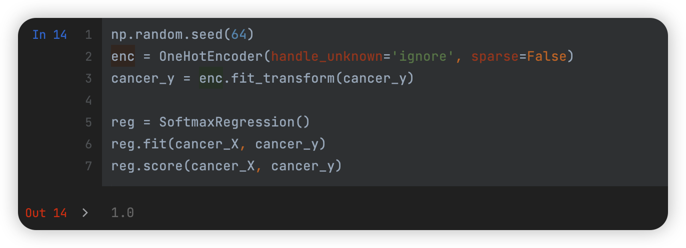
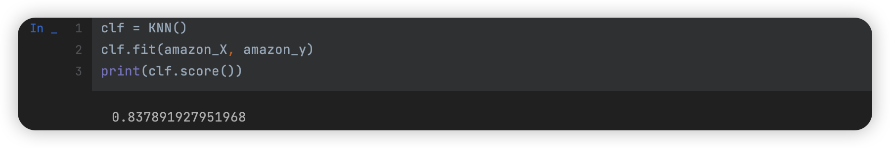

#  数据挖掘：实验四 Logistic回归与KNN算法

| 课程 | 数据挖掘   |
| ---- | ---------- |
| 学号 | 32001261   |
| 姓名 | 舒恒鑫     |
| 班级 | 计算机2004 |

## 实验目的和要求

通过在Python中的实例应用，分析掌握KNN算法的基本原理，加深对KNN算法的理解，并掌握将算法应用于实际的方法、步骤。

## 实验内容和原理

1. 在Python中完成多分类的Logistic回归模型的程序设计；
2. 在Python中完成KNN算法模型的数据输入、参数设置；
3. 对Python中KNN算法的实例数据输出结果进行分析。

## 操作方法和实验步骤

### 体验KNN算法。给定以下的疾病诊断数据集。这个数据集包含1个病人代号的字段、5个条件字段(喉咙痛、发烧、淋巴腺肿胀、充血、头痛)以及一个目标字段(诊断结果)

| 病人代号 | 喉咙痛 | 发烧 | 淋巴腺肿胀 | 充血 | 头痛 | 诊断结果   |
| -------- | ------ | ---- | ---------- | ---- | ---- | ---------- |
| 1        | Yes    | Yes  | Yes        | Yes  | Yes  | 链球菌喉炎 |
| 2        | No     | No   | No         | Yes  | Yes  | 过敏       |
| 3        | Yes    | Yes  | No         | Yes  | No   | 感冒       |
| 4        | Yes    | No   | Yes        | No   | No   | 链球菌喉炎 |
| 5        | No     | Yes  | No         | Yes  | No   | 感冒       |
| 6        | No     | No   | No         | Yes  | No   | 过敏       |
| 7        | No     | No   | Yes        | No   | No   | 链球菌喉炎 |
| 8        | Yes    | No   | No         | Yes  | Yes  | 过敏       |
| 9        | No     | Yes  | No         | Yes  | Yes  | 感冒       |
| 10       | Yes    | Yes  | No         | Yes  | Yes  | 感冒       |
| 11       | NO     | NO   | YES        | YES  | YES  | ?          |
| 12       | YES    | YES  | NO         | NO   | YES  | ?          |

1. 利用KNN预测11、12号病人的诊断结果 (K = 3)

   Distance 的计算方式：

   - Distance (Yes, No) = 1

   - Distance (Yes, Yes) = 0  

   - Distance (No, No) = 0

   两客户的Distance为每一字段之Distance的加总，即Manhattan Distance / City Block Distance

### 下载数据集cancer_X.csv，cancer_y.csv，amazon_X.csv，amazon_y.csv，实现如下功能：

1. 利用Python语言实现多分类的Logistic回归模型的程序设计，并给出上述两组数据的Logistic回归模型的准确率（测试集与训练集相同）。
2. 利用Python语言实现KNN算法，并给出不同的邻近点个数k对应的预测准确率（测试集与训练集相同）。

## 实验结果和分析

### Answer01

将疾病种类编码：

| 疾病种类   | 编码 |
| ---------- | ---- |
| 链球菌喉炎 | 0    |
| 过敏       | 1    |
| 感冒       | 2    |

```python
def _square_distance(v1, v2):
    sum = 0
    for i in range(len(v1)):
        if v1[i] != v2[i]:
            sum += 1
    return sum


def _vote(ys):
    vote_dict = {}
    for y in ys:
        y = y[0]
        if y not in vote_dict.keys():
            vote_dict[y] = 1
        else:
            vote_dict[y] += 1
    sorted_vote_dict = sorted(vote_dict.items(), key=operator.itemgetter(1), reverse=True)
    return sorted_vote_dict[0][0]  # 将已经记好的数进行一个自大而小的排列(则是一个降序排序），若reverse是false,则是自小而大.(升序排序）


class KNN:
    def __init__(self, k=3):
        self.x = None
        self.y = None
        self.k = k

    # 用于后期的模型计算，输入训练集目标数据以及训练数据x。
    def fit(self, x, y):
        self.x = x
        self.y = y

    def predict(self, x):
        y_pred = []  # 定义一个空集合，用于y_pred（预测）
        # 进行遍历，得到x的长度,range是一个从一开始，直到x，步长为1
        for i in range(len(x)):
            dist_arr = [_square_distance(x[i], self.x[j]) for j in range(len(self.x))]
            sorted_index = np.argsort(dist_arr)
            top_k_index = sorted_index[:self.k]
            y_pred.append(_vote(ys=self.y[top_k_index]))  # 调用了_vote函数，属于自身调用，去进行分类
        return np.array(y_pred)

    def score(self, y_true=None, y_pred=None):
        if y_true is None and y_pred is None:
            y_pred = self.predict(self.x)
            y_true = self.y
        score = 0.0
        for i in range(len(y_true)):
            if y_true[i] == y_pred[i]:
                score += 1
        score /= len(y_true)
        return score
```



### Answer02

#### 使用 sklearn.linear_model.LogisticRegression 进行多分类





#### 使用逻辑回归进行多分类

```python
class SoftmaxRegression:
    def __init__(self):
        self.n_samples = None
        self.n_features = None
        self.n_classes = None
        self.weights = None
        self.all_loss = list()

    def fit(self, x, y, iters=1000, alpha=0.1, lam=0.01):
        self.n_samples, self.n_features = x.shape
        self.n_classes = y.shape[1]
        # self.weights = np.random.rand(self.n_classes, self.n_features)  # 使用随机初始化会造成运算异常
        self.weights = np.zeros((self.n_classes, self.n_features))

        for i in range(iters):
            probs = self._softmax(x)
            loss = - (1 / self.n_samples) * np.sum(y * np.nan_to_num(np.log(probs)))
            self.all_loss.append(loss)

            dw = -(0.5 / self.n_samples) * np.dot((y - probs).T, x) + lam * self.weights
            dw[:, 0] -= lam * self.weights[:, 0]
            self.weights -= alpha * dw

    def predict(self, test_x):
        probs = self._softmax(test_x)
        return np.argmax(probs, axis=1).reshape((-1, 1))

    def score(self, test_x, test_y):
        score = 0.0
        for i in range(len(test_y)):
            if (self.predict([test_x[i]]) == np.argmax(test_y[i])).any():
                score += 1
        return score / len(test_y)

    def _softmax(self, x):
        scores = np.dot(x, self.weights.T)
        sm = np.exp(scores) / np.sum(np.exp(scores), axis=1, keepdims=True)
        sm = np.nan_to_num(sm)
        return sm
```





#### 使用 KNN 进行多分类

代码同 Answer01



