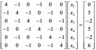
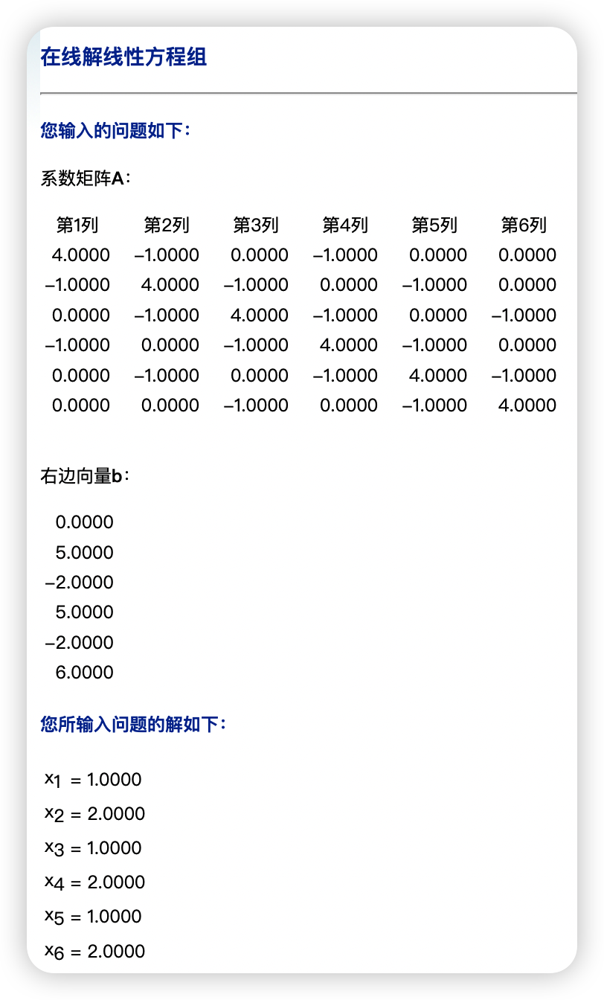

# 数据挖掘：实验一 线性代数基础

| 课程 | 数据挖掘   |
| ---- | ---------- |
| 学号 | 32001261   |
| 姓名 | 舒恒鑫     |
| 班级 | 计算机2004 |

## 实验目的和要求

  利用软件实现线性方程组迭代法求解的计算方法，为后续学习作准备。

## 实验内容和原理

- 完成Jacobi迭代法求解线性方程组的程序；
- 完成Gauss-Seidel迭代法求解线性方程组的程序。

## 操作方法和实验步骤

用下列迭代法解线性方程组：



并求出近似解及相应的迭代次数，其中取迭代初始向量为零向量。输入参数：矩阵A，右端项b，初始向量x，迭代次数N，精度tol。参数：x，迭代次数m

### 测试方法

- Jacobi迭代法
- Gauss-Seidel迭代法

### 参考答案



## 实验结果和分析

```python
import numpy as np

A = np.array([[4, -1, 0, -1, 0, 0],
              [-1, 4, -1, 0, -1, 0],
              [0, -1, 4, -1, 0, -1],
              [-1, 0, -1, 4, -1, 0],
              [0, -1, 0, -1, 4, -1],
              [0, 0, -1, 0, -1, 4]])
b = np.array([0, 5, -2, 5, -2, 6])
```

### Jacobi迭代法

```python
def jacobi(A, B, n):
    X, Y, D = np.full(n, 0.), np.full(n, 0.), np.full(n, 0.)
    k = 0
    while True:
        X = Y
        for i in range(n):
            tem = 0.
            for j in range(n):
                if i != j:
                    tem += A[i][j] * X[j]
            Y[i] = (B[i] - tem) / A[i][i]
        # print(Y)
        k += 1
        if k > 1000:
            print("迭代失败！（可能是函数不收敛）")
            return
        for a in range(n):
            D[a] = X[a] - Y[a]
        if k > 30 and 0.00001 > np.max(D) > -0.00001:
            return Y

print(jacobi(A, b, 6))
```

结果：[1. 2. 1. 2. 1. 2.]

### Gauss-Seidel迭代法

```python
def gauss_seidel(A, B, n):
    X = np.full(n, 0.)
    k = 0
    while True:
        tol = 0.
        for i in range(n):
            tem = 0.
            for j in range(n):
                if i != j:
                    tem += A[i][j] * X[j]
            x_i_old = X[i]
            X[i] = (B[i] - tem) / A[i][i]
            tol += abs(X[i] - x_i_old)
        if tol / n < 1e-10:
            break
        # print(X)
        k += 1
        if k > 100:
            print("迭代失败！（可能是函数不收敛）")
            return
    return X
  
print(gauss_seidel(A, b, 6))
```

结果：[1. 2. 1. 2. 1. 2.]