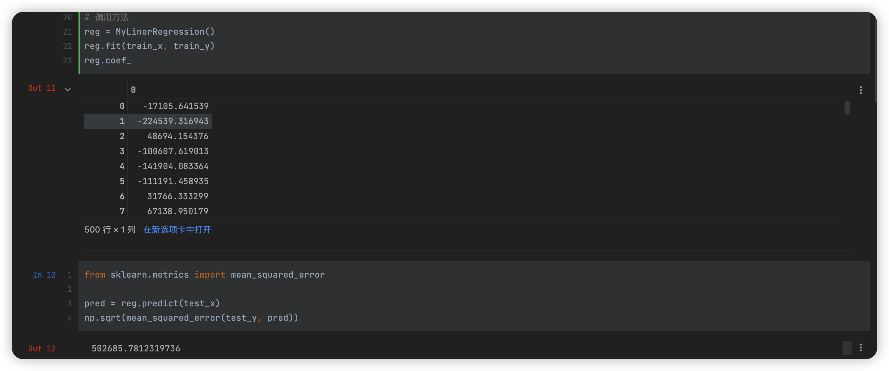
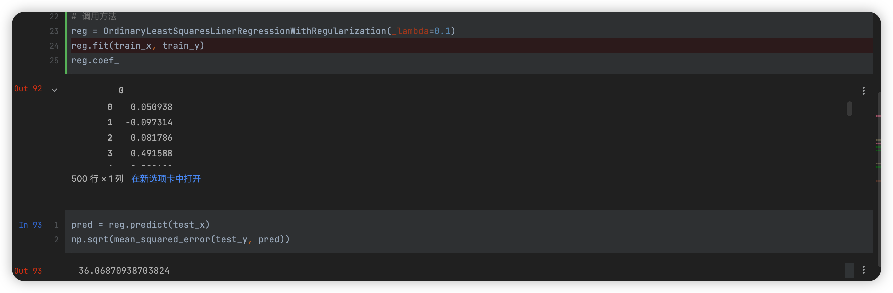
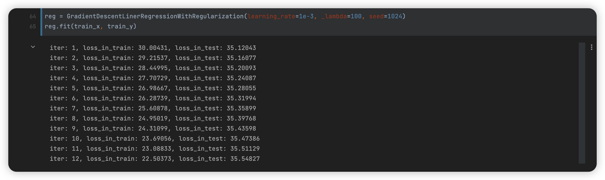
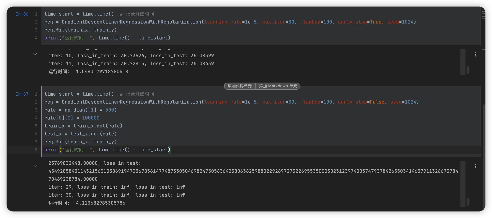
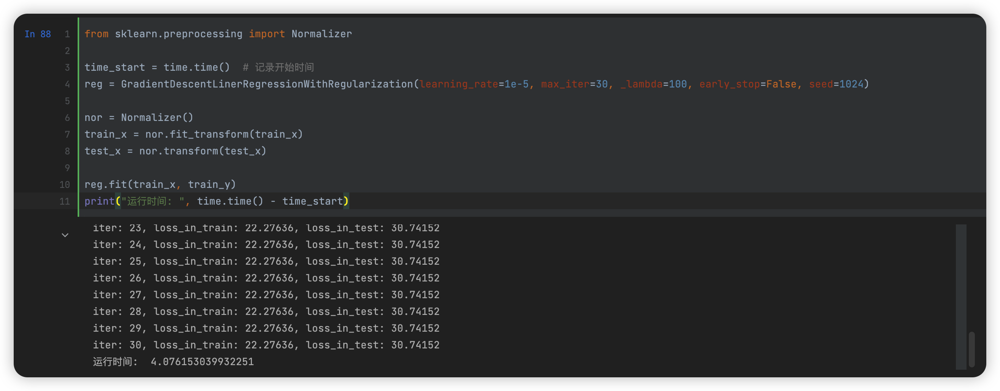

#  image

| 课程 | 数据挖掘   |
| ---- | ---------- |
| 学号 | 32001261   |
| 姓名 | 舒恒鑫     |
| 班级 | 计算机2004 |

## 实验目的和要求

通过在Python中的实例应用，分析掌握线性回归分析方法的基本原理，加深对线性回归分析算法的理解，并掌握将算法应用于实际的方法、步骤。

## 实验内容和原理

- 在 Python 中完成线性回归算法模型的数据输入、参数设置；
- 对 Python 中线性回归算法的实例数据输出结果进行分析。

## 操作方法和实验步骤

### 用Python语言实现线性回归算法，针对随机数据（```randn_data_regression_X```, ```randn_data_regression_y```），要求完成

1. 方法一：解线性方程组计算得到线性回归模型的参数
2. 方法二：利用梯度下降法计算线性回归模型的参数。
3. 在线性回归模型中加入正则化项，实现计算过程。 

### 对```randn_data_regression_X```的某一列乘上一个很大的数（比如100000），再调用梯度下降法计算线性回归模型的参数，你有什么发现？你觉得如何处理才有可能降低梯度下降法的迭代步数？

## 实验结果和分析

### 实现线性回归算法

#### 方法一

通过最小二乘法得到解：

```python
# 封装最小二乘法
class OrdinaryLeastSquaresLinerRegression:
    def __init__(self):
        self._theta = None
        self.intercept_ = None
        self.coef_ = None

    def fit(self, x_train, y_train):
        X_b = np.hstack([np.ones((len(x_train), 1)), x_train])
        self._theta = np.linalg.inv(X_b.T.dot(X_b)).dot(X_b.T).dot(y_train)
        self.intercept_ = self._theta[0]
        self.coef_ = self._theta[1:]
        return self

    def predict(self, x_predict):
        X_b = np.hstack([np.ones((len(x_predict), 1)), x_predict])
        return X_b.dot(self._theta)
```



#### 方法二

通过梯度下降法得到解：

```python
# 封装梯度下降法
class GradientDescentLinerRegression:
    def __init__(self, learning_rate=0.01, max_iter=1000, early_stop=True, seed=None):
        np.random.seed(seed)
        self.early_stop = early_stop
        self.lr = learning_rate  # 设置学习率
        self.max_iter = max_iter
        self.loss_arr = []
        self.intercept_ = None
        self.coef_ = None

    def fit(self, x, y):
        self.x = x
        self.x_b = np.hstack([np.ones((len(x), 1)), x])
        self.x_b_dim = np.size(self.x_b, 1)
        self.x_sample = np.size(self.x_b, 0)
        self.y = y
        self.w = np.random.normal(1, 0.001, (self.x_b_dim, 1))
        for i in range(self.max_iter):
            self._train_step()
            self.loss_arr.append(self.loss())
            print("iter: {}, loss_in_train: {:.5f}, loss_in_test: {:.5f}".format(i + 1, self.loss(is_test=False), self.loss_arr[-1]))

            # 连续十次不下降则退出
            if len(self.loss_arr) > 10:
                arr = np.array(self.loss_arr[:-10])
                if np.sum(arr[0] < arr) != 0:
                    return

    def _f(self, x, w):
        return x.dot(w)

    def predict(self, x=None):
        if x is None:
            x = self.x_b
        x = np.hstack([np.ones((len(x), 1)), x])
        y_pred = self._f(x, self.w)
        return y_pred

    def loss(self, is_test=True, y_true=None, y_pred=None):
        if y_true is None or y_pred is None:
            y_true = self.y
        if is_test:
            return np.sqrt(mean_squared_error(test_y, self.predict(test_x)))
        else:
            return np.sqrt(mean_squared_error(y_true, self.predict(self.x)))

    def _calc_gradient(self):
        d_w = np.empty(self.x_b_dim).reshape(-1, 1)
        d_w[0] = np.sum(self.x_b.dot(self.w) - self.y)
        for i in range(1, self.x_b_dim):
            # print("{} {} {} {}".format(self.x_b.shape, self.w.shape, self.y.shape, self.x_b[:, i].T.shape))
            d_w[i] = np.squeeze((self.x_b.dot(self.w) - self.y)).dot(self.x_b[:, i].T)
        return d_w * 2 / self.x_sample

    def _train_step(self):
        d_w = self._calc_gradient()
        self.w = self.w - self.lr * d_w
        self.intercept_ = self.w[0]
        self.coef_ = self.w[1:]
        return self.w
```


#### 加入正则化项

```python
# 封装最小二乘法(包含正则化项)
class OrdinaryLeastSquaresLinerRegressionWithRegularization:
    def __init__(self, _lambda=0.1):
        self._lambda = _lambda
        self._theta = None
        self.intercept_ = None
        self.coef_ = None

    def fit(self, x_train, y_train):
        r = np.diag([self._lambda] * (x_train.shape[1] + 1))
        r[0][0] = 0
        X_b = np.hstack([np.ones((len(x_train), 1)), x_train])
        self._theta = np.linalg.inv(X_b.T.dot(X_b) + r).dot(X_b.T).dot(y_train)
        self.intercept_ = self._theta[0]
        self.coef_ = self._theta[1:]
        return self

    def predict(self, x_predict):
        X_b = np.hstack([np.ones((len(x_predict), 1)), x_predict])
        return X_b.dot(self._theta)
```



```python
# 封装梯度下降法(包含正则化项)
class GradientDescentLinerRegressionWithRegularization:
    def __init__(self, learning_rate=0.01, max_iter=1000, _lambda=0.1, early_stop=True, seed=None):
        np.random.seed(seed)
        self.early_stop = early_stop
        self._lambda = _lambda
        self.lr = learning_rate  # 设置学习率
        self.max_iter = max_iter
        self.loss_arr = []
        self.intercept_ = None
        self.coef_ = None

    def fit(self, x, y):
        self.x = x
        self.x_b = np.hstack([np.ones((len(x), 1)), x])
        self.x_b_dim = np.size(self.x_b, 1)
        self.x_sample = np.size(self.x_b, 0)
        self.y = y
        self.w = np.random.normal(1, 0.001, (self.x_b_dim, 1))
        for i in range(self.max_iter):
            self._train_step()
            self.loss_arr.append(self.loss())
            print("iter: {}, loss_in_train: {:.5f}, loss_in_test: {:.5f}".format(i + 1, self.loss(is_test=False), self.loss_arr[-1]))

            # 连续十次不下降则退出
            if self.early_stop and len(self.loss_arr) > 10:
                arr = np.array(self.loss_arr[:-10])
                if np.sum(arr[0] < arr) != 0:
                    return

    def _f(self, x, w):
        return x.dot(w)

    def predict(self, x=None):
        if x is None:
            x = self.x_b
        x = np.hstack([np.ones((len(x), 1)), x])
        y_pred = self._f(x, self.w)
        return y_pred

    def loss(self, is_test=True, y_true=None, y_pred=None):
        if y_true is None or y_pred is None:
            y_true = self.y
        if is_test:
            return np.sqrt(mean_squared_error(test_y, self.predict(test_x)))
        else:
            return np.sqrt(mean_squared_error(y_true, self.predict(self.x)))

    def _calc_gradient(self):
        d_w = np.empty(self.x_b_dim).reshape(-1, 1)
        d_w[0] = np.sum(self.x_b.dot(self.w) - self.y)
        for i in range(1, self.x_b_dim):
            # print("{} {} {} {}".format(self.x_b.shape, self.w.shape, self.y.shape, self.x_b[:, i].T.shape))
            d_w[i] = np.squeeze((self.x_b.dot(self.w) - self.y)).dot(self.x_b[:, i].T)
        return d_w * 2 / self.x_sample + (self._lambda / self.x_sample * self.w)

    def _train_step(self):
        d_w = self._calc_gradient()
        self.w = self.w - self.lr * d_w
        self.intercept_ = self.w[0]
        self.coef_ = self.w[1:]
        return self.w
```



### 梯度下降法在异常数据下的问题

由于我在方法内规定，在测试集上 loss 连续 10 次不下降则停止迭代，因此导致我的两次结果不明显，因此关闭了自动退出功能并固定了循环次数：



可以看到异常数据不仅花费时间为正常数据的 2.5 倍，同时也出现 inf 异常 loss 结果。

**解决办法：引入归一化方法**

这里用的是 sklearn.preprocessing.Normalizer

