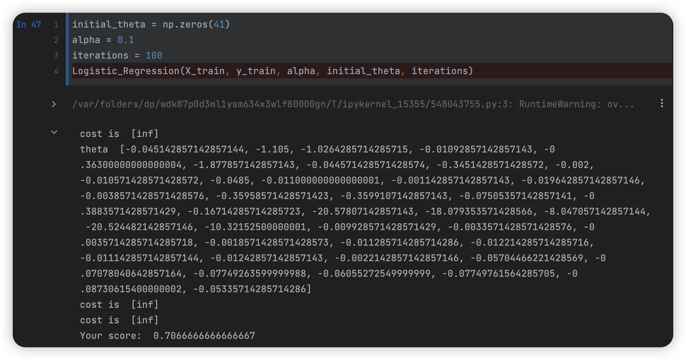
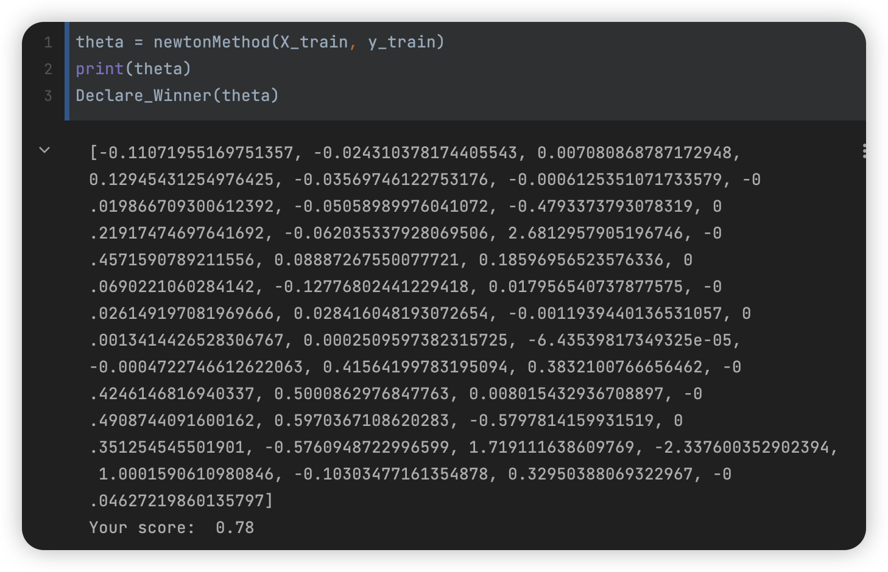
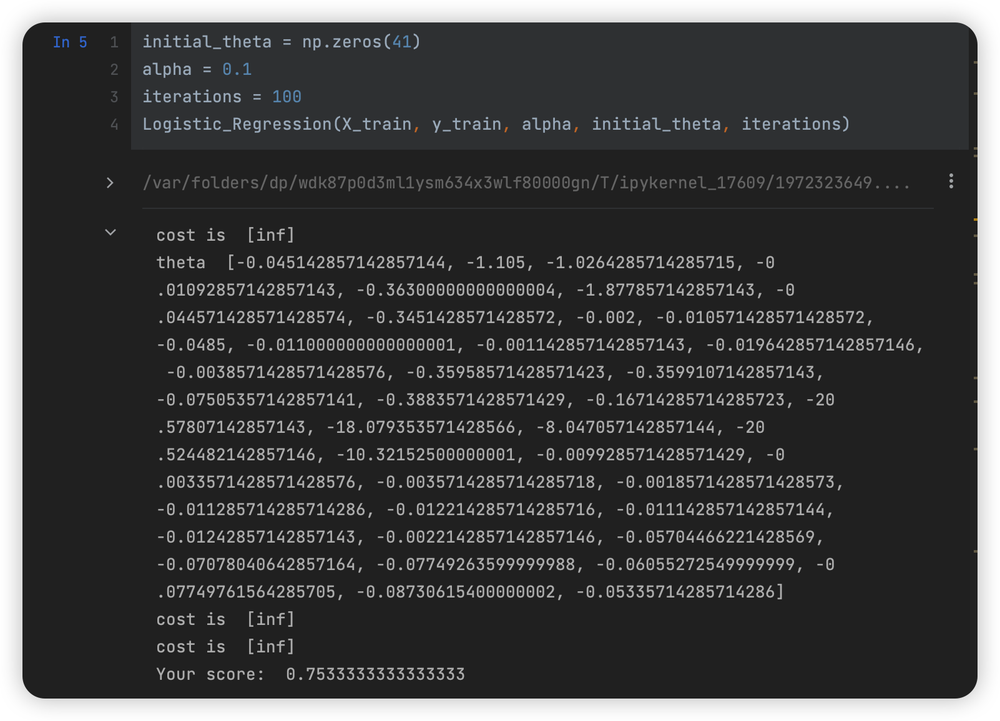
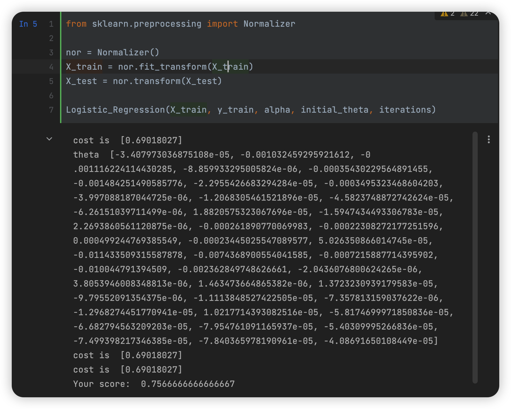

#  数据挖掘：实验三 Logistic 回归

| 课程 | 数据挖掘   |
| ---- | ---------- |
| 学号 | 32001261   |
| 姓名 | 舒恒鑫     |
| 班级 | 计算机2004 |

## 实验目的和要求

通过在Python中的实例应用，分析掌握Logistic回归分析方法的基本原理，加深对Logistic回归分析算法的理解，并掌握将算法应用于实际的方法、步骤。

## 实验内容和原理

- 在Python中完成Logistic回归算法模型的数据输入、参数设置；
- 对Python中Logistic回归算法的实例数据输出结果进行分析。

## 操作方法和实验步骤

### Question1

用Python语言实现Logistic回归算法，下载数据集telco.csv，数据集包括“region”（地区）、“tenure”（服务的月数）、“age”（年龄）以及“churn”（客户流失）等42个字段。属性churn的取值为“0”或者“1”，其中“0”表示没有流失，“1”表示流失。，要求完成：

1. 利用梯度下降法计算Logistic回归模型的参数。

2. 利用牛顿法计算Logistic回归模型的参数。(hint: Logistic回归分析方法求解中的负对数极大似然函数的二阶Hessian矩阵如下：
   $$
   H = X^TDX,D=diag(d_1,d_2,...,d_m),d_i=g(x^T_iw)(1-g(x^T_iw)),\\
   diag(d_1,d_2,...,d_m)代表以d_1,d_2,...,d_m为对角元的对角矩阵
   $$

3. 在Logistic回归模型中加入正则化项，实现计算过程。

### Question2

对数据的某一列乘上一个很大的数（比如100000），再分别调用梯度上升法与牛顿法计算Logistic回归模型的参数，你有什么发现？

## 实验结果和分析

### 逻辑回归梯度下降法

主要代码：

```python
# The sigmoid function
def Sigmoid(z):
    return float(1.0 / float((1.0 + np.exp(-1.0 * z))))


def Hypothesis(theta, x):
    z = 0
    for i in range(len(theta)):
        z += x[i] * theta[i]
    return Sigmoid(z)


def Cost_Function(X, Y, theta, m):
    sumOfErrors = 0
    for i in range(m):
        xi = X[i]
        hi = Hypothesis(theta, xi)
        if Y[i] == 1:
            error = Y[i] * np.log(hi)
        elif Y[i] == 0:
            error = (1 - Y[i]) * np.log(1 - hi)
        sumOfErrors += error
    const = -1 / m
    J = const * sumOfErrors
    print('cost is ', J)
    return J


def Cost_Function_Derivative(X, Y, theta, j, m, alpha):
    sumErrors = 0
    for i in range(m):
        xi = X[i]
        xij = xi[j]
        hi = Hypothesis(theta, X[i])
        error = (hi - Y[i]) * xij
        sumErrors += error
    m = len(Y)
    constant = float(alpha) / float(m)
    return constant * sumErrors


def Gradient_Descent(X, Y, theta, m, alpha):
    new_theta = []
    for j in range(len(theta)):
        CFDerivative = Cost_Function_Derivative(X, Y, theta, j, m, alpha)
        new_theta_value = theta[j] - CFDerivative
        new_theta.append(*new_theta_value)
    return new_theta


def Declare_Winner(theta):
    score = 0
    length = len(X_test)
    for i in range(length):
        prediction = round(Hypothesis(X_test[i], theta))
        answer = y_test[i]
        if prediction == answer:
            score += 1

    my_score = float(score) / float(length)
    print('Your score: ', my_score)


def Logistic_Regression(X, Y, alpha, theta, num_iters):
    m = len(Y)
    for x in range(num_iters):
        new_theta = Gradient_Descent(X, Y, theta, m, alpha)
        theta = new_theta
        if x % 100 == 0:
            Cost_Function(X, Y, theta, m)
            print('theta ', theta)
            print('cost is ', Cost_Function(X, Y, theta, m))
    Declare_Winner(theta)
```



- 这里也因为数据内的异常值从而出现了【inf】

### 逻辑回归牛顿法

```python
# sigmod函数
def sigmoid(x):
    return 1.0 / (1+math.exp(-x))


# 计算hessian矩阵
def computeHessianMatrix(data, hypothesis):
    hessianMatrix = []
    n = len(data)

    for i in range(n):
        row = []
        for j in range(n):
            row.append(-data[i]*data[j]*(1-hypothesis)*hypothesis)
        hessianMatrix.append(row)
    return hessianMatrix


# 计算两个向量的点积
def computeDotProduct(a, b):
    if len(a) != len(b):
        return False
    n = len(a)
    dotProduct = 0
    for i in range(n):
        dotProduct += a[i] * b[i]
    return dotProduct


# 计算两个向量的和
def computeVectPlus(a, b):
    if len(a) != len(b):
        return False
    n = len(a)
    sum = []
    for i in range(n):
        sum.append(a[i]+b[i])
    return sum


# 计算某个向量的n倍
def computeTimesVect(vect, n):
    nTimesVect = []
    for i in range(len(vect)):
        nTimesVect.append(*(n * vect[i]))
    return nTimesVect


# 牛顿法
def newtonMethod(dataMat, labelMat, iterNum=10):
    m = len(dataMat)  # 训练集个数
    n = len(dataMat[0])  # 数据特征纬度
    theta = [0.0] * n

    while (iterNum):
        gradientSum = [0.0] * n
        hessianMatSum = [[0.0] * n] * n
        for i in range(m):
            try:
                hypothesis = sigmoid(computeDotProduct(dataMat[i], theta))
            except:
                continue
            error = labelMat[i] - hypothesis
            gradient = computeTimesVect(dataMat[i], error / m)
            gradientSum = computeVectPlus(gradientSum, gradient)
            hessian = computeHessianMatrix(dataMat[i], hypothesis / m)
            for j in range(n):
                hessianMatSum[j] = computeVectPlus(hessianMatSum[j], hessian[j])

        # 计算hessian矩阵的逆矩阵有可能异常，如果捕获异常则忽略此轮迭代
        try:
            hessianMatInv = np.mat(hessianMatSum).I.tolist()
        except:
            continue
        for k in range(n):
            theta[k] -= computeDotProduct(hessianMatInv[k], gradientSum)

        iterNum -= 1
    return theta
```



### 逻辑回归梯度下降法（含正则化项）

```python
def Cost_Function_Derivative(X, Y, theta, j, m, alpha, _lamda):
    sumErrors = 0
    for i in range(m):
        xi = X[i]
        xij = xi[j]
        hi = Hypothesis(theta, X[i])
        error = (hi - Y[i]) * xij
        sumErrors += error
    m = len(Y)
    constant = float(alpha) / float(m) + (_lamda / float(m) * theta[j])
    return constant * sumErrors
```



### 改变数据后使用数据归一化

改变数据后，出现如下问题：

- 时间花费更久
- 拟合速度更快，且不会出现【inf】异常结果



