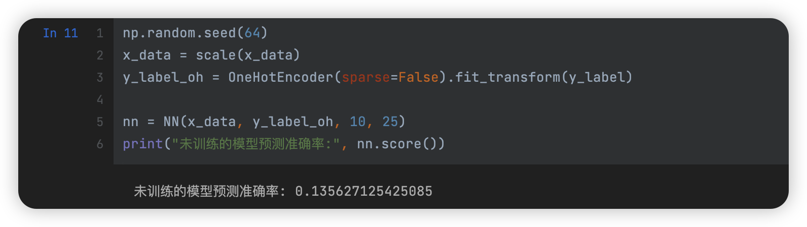
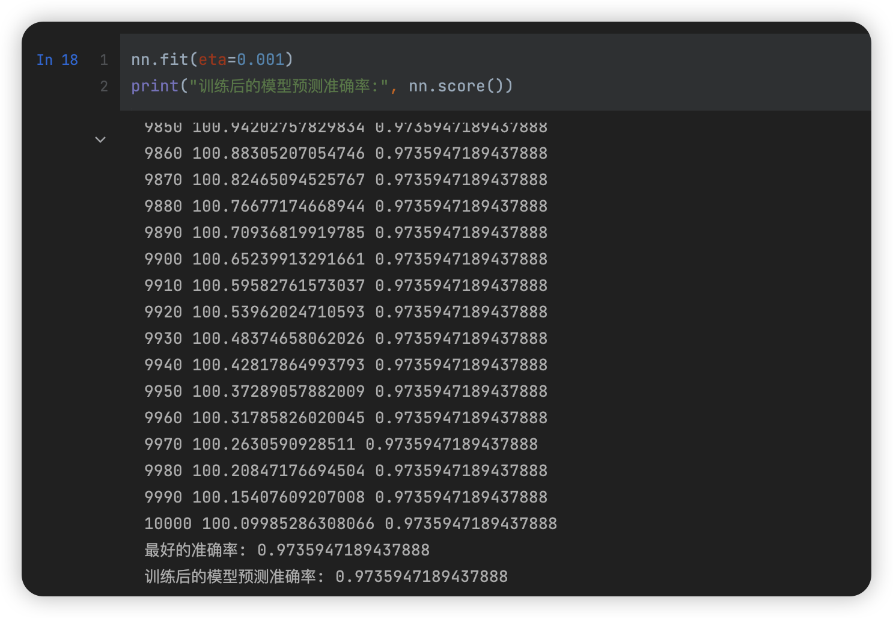

# 数据挖掘：实验七 神经网络续

| 课程 | 数据挖掘   |
| ---- | ---------- |
| 学号 | 32001261   |
| 姓名 | 舒恒鑫     |
| 班级 | 计算机2004 |

## 实验目的和要求

通过在Python中的实例应用，分析神经网络的基本原理，加深神经网络前向反馈的理解，并掌握将算法应用于实际的方法、步骤。

## 实验内容和原理

1. 在Python中完成神经网络的后向传播的基本原理，完成参数学习。

## 操作方法和实验步骤

实现神经网络的参数计算过程：

1. 请下载数据给定X_data，y_label，设计一个输入节点个数为400，隐藏层节点个数为25，输出节点个数为10的神经网络。随机产生参数的初始值，计算该初始值对应的梯度。
2. 利用梯度下降法求解参数，并给出神经网络的分类准确率。

## 实验结果和分析

```python
def sigmoid(z):
    return 1.0 / (1.0 + np.exp(-z))


class NN:
    def __init__(self, x, y, classes, hidden_features):
        self.x = x
        self.y = y
        self.classifications = classes
        self.samples, self.features = x.shape
        self.hidden_features = hidden_features

        self.weights1 = np.random.rand(self.features, self.hidden_features)
        self.weights2 = np.random.rand(self.hidden_features, self.classifications)
        self.bias1 = 1
        self.bias2 = 1

        self.net_hidden = None
        self.sigmoid_hidden = None
        self.net_out = None
        self.sigmoid_out = None

    def fit(self, epochs=10000, eta=1e-2):
        print("--------------训练开始--------------")
        max_score = 0
        for i in np.arange(1, epochs + 1):
            self.x, self.y = shuffle(self.x, self.y)
            self._forward_propagation()
            self._back_propagation(eta)

            s = self.score()
            if s < max_score:
                max_score = s

            if i % 10 == 0:
                print(i, self._calculate_square_error(), s)
        print("最好的准确率:", max_score)

    def predict(self, x_test):
        self._forward_propagation(x_test)
        pred_zeros = np.zeros((self.samples, self.classifications))
        for i in range(len(self.sigmoid_out)):
            pred_zeros[i, np.argmax(self.sigmoid_out[i])] = 1
        return pred_zeros

    def score(self, x_test=None, y_test=None):
        if x_test is None and y_test is None:
            x_test, y_test = self.x, self.y
        pred = [np.argmax(i) for i in self.predict(x_test)]
        label = [np.argmax(i) for i in y_test]
        s = 0.0
        for i in range(len(pred)):
            if label[i] == pred[i]:
                s += 1
        return s / x_test.shape[0]

    def _forward_propagation(self, x_test=None):
        """前向传播"""
        # 输入层---->隐含层
        self.net_hidden = np.dot(self.x if x_test is None else x_test, self.weights1) + self.bias1
        self.sigmoid_hidden = sigmoid(self.net_hidden)
        # 隐含层---->输出层
        self.net_out = np.dot(self.sigmoid_hidden, self.weights2) + self.bias2
        self.sigmoid_out = sigmoid(self.net_out)

    def _back_propagation(self, eta):
        """反向传播"""
        delta_out = -(self.y - self.sigmoid_out) * (self.sigmoid_out * (1 - self.sigmoid_out))
        theta_weight2 = np.dot(self.sigmoid_hidden.T, delta_out)

        delta_hidden = np.sum(np.concatenate(
            [(delta_out * self.weights2[i]).reshape(self.samples, 1, self.classifications) for i in
             range(self.hidden_features)], 1), axis=2) * (self.sigmoid_hidden * (1 - self.sigmoid_hidden))
        theta_weight1 = np.dot(self.x.T, delta_hidden)

        self.weights1 -= eta * theta_weight1  # 隐含层---->输出层的偏置项更新
        self.bias1 -= eta * np.sum(delta_hidden)  # 隐含层---->输出层的权值更新
        self.weights2 -= eta * theta_weight2  # 输入层---->隐含层的偏置项更新
        self.bias2 -= eta * np.sum(delta_out)  # 输入层---->隐含层的权值更新

    def _calculate_square_error(self, x_test=None, y_test=None):
        if x_test is None and y_test is None:
            x_test, y_test = self.x, self.y
        return 0.5 * np.sum((y_test - self.sigmoid_out) ** 2)
```

### Answer01



### Answer02

