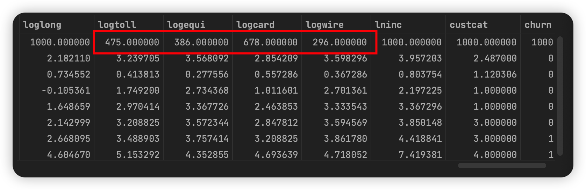
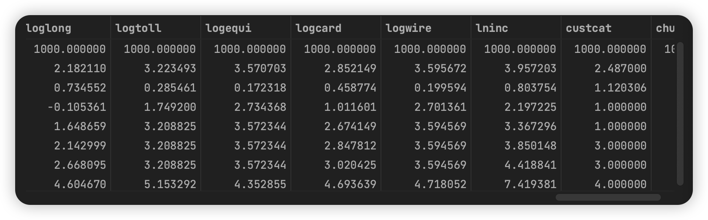
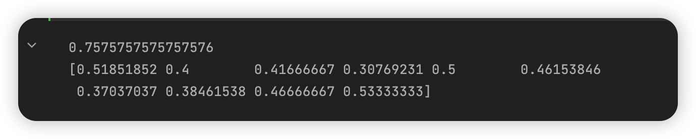
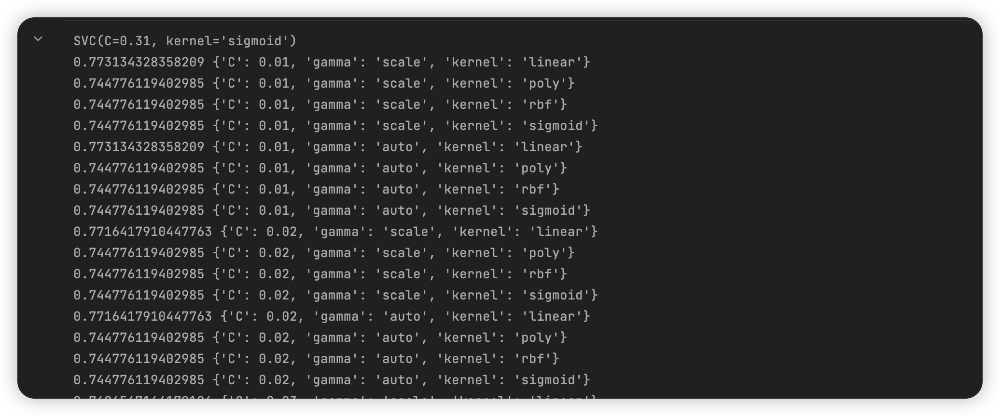
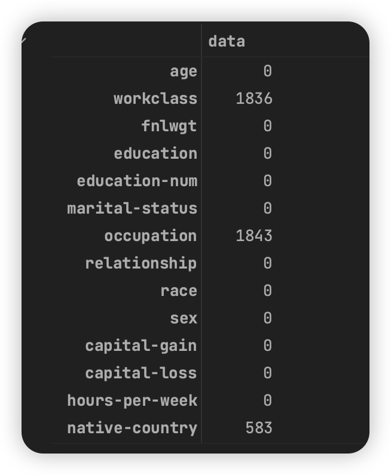
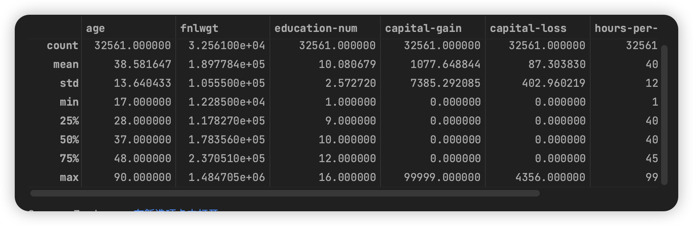
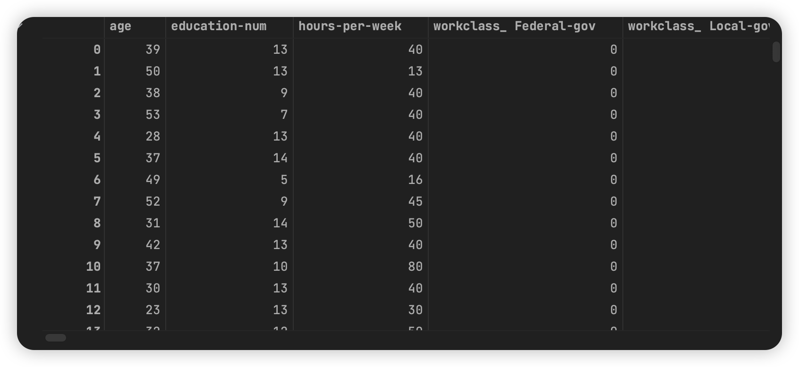
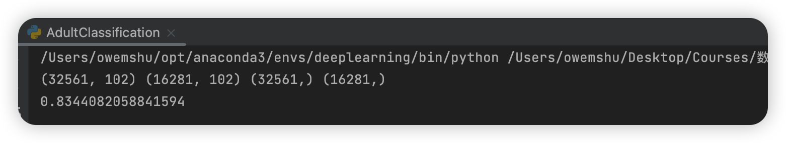

# 数据挖掘：实验八 支持向量机

| 课程 | 数据挖掘   |
| ---- | ---------- |
| 学号 | 32001261   |
| 姓名 | 舒恒鑫     |
| 班级 | 计算机2004 |

## 实验目的和要求

通过在Python中的实例应用，分析掌握支持向量机算法进行数据挖掘的基本原理，加深对支持向量机算法的理解，并掌握将算法应用于实际的方法、步骤。

## 实验内容和原理

1. 在Python中支持向量机算法模型的数据输入、参数设置；
2. 对Python中支持向量机算法的实例数据输出结果进行分析。

## 操作方法和实验步骤

在Python中应用支持向量机算法的过程：

1. 打开数据集telco.csv，调用Python的sklearn库中的支持向量机函数实现支持向量机分类的程序，可以参考https://scikit-learn.org/stable/modules/svm.html。
2. 在https://archive.ics.uci.edu/ml/datasets/Adult下载数据，这是从一个家庭的人口普查表格中得到有14个属性的数据，其任务是预测家庭的收入是否大于5万美元，请利用支持向量机对目标进行分类。

## 实验结果和分析

### telco数据分类

数据清理——处理含有缺失值的数据，这里用中位数填充。



```python
data = telco.copy()

# 使用中位数填充
for field in ['logtoll', 'logequi', 'logcard', 'logwire']:
    median = data[field].median()
    data[field].fillna(median, inplace=True)
data.describe()
```



数据预处理——特征缩放，这里使用了标准化

```python
from sklearn.model_selection import train_test_split
from sklearn.preprocessing import StandardScaler

data_x = data.iloc[:, :41]
data_y = data.iloc[:, 41:]

data_x = StandardScaler().fit_transform(data_x)

X_train, X_test, y_train, y_test = train_test_split(data_x, data_y, test_size=0.33, random_state=64)
```

先训练一个简单的 svm，这里使用默认参数训练，以 f1 标准进行 10 折交叉验证

```python
from sklearn.model_selection import cross_val_score
from sklearn.svm import SVC

svm = SVC()
print(svm.fit(X_train, y_train).score(X_test, y_test))
print(cross_val_score(svm, X_train, y_train, scoring='f1', cv=10))
```



微调模型——网格搜索

```python
import numpy as np
from sklearn.model_selection import GridSearchCV

'''微调模型: 随机搜索'''
param_grid = {
    'C': np.arange(0.01, 2, 0.01),
    'kernel': ['linear', 'poly', 'rbf', 'sigmoid'],
    'gamma': ['scale', 'auto']
}
grid_search = GridSearchCV(SVC(), param_grid, cv=10, scoring='accuracy', n_jobs=-1)
grid_search.fit(X_train, y_train)
print(grid_search.best_estimator_)

cvres = grid_search.cv_results_
for mean_score, params in zip(cvres['mean_test_score'], cvres['params']):
    print(mean_score, params)
```



分析最佳模型及其误差

```python
grid_search.best_estimator_.score(data_x, data_y)
```


可以注意到，这里虽然 TrainDataSet 上的 Accuracy 增加了，但在 TestDataSet 的 Accuracy 下降了

### adult 数据分类

#### 数据集描述

| name           | 中文         | type                                                         |
| -------------- | ------------ | ------------------------------------------------------------ |
| age            | 年龄         | continuous                                                   |
| workclass      | 工人阶级     | Private、Self-emp-not-inc、Self-emp-inc、Federal-gov、Local-gov、State-gov、Without-pay、Never-worked |
| fnlwgt         | fnlwgt       | continuous                                                   |
| education      | 教育         | Bachelors、Some-college、11th、HS-grad、Prof-school、Assoc-acdm、Assoc-voc、9th、7th-8th、12th、Masters、1st-4th、10th、Doctorate、5th-6th、Preschool |
| education-num  | 最高教育水平 | continuous                                                   |
| marital-status | 婚姻状况     | Married-civ-spouse、Divorced、Never-married、Separated、Widowed、Married-spouse-absent、Married-AF-spouse |
| occupation     | 职业         | Tech-support、Craft-repair、Other-service、Sales、Exec-managerial、Prof-specialty、Handlers-cleaners、Machine-op-inspct、Adm-clerical、Farming-fishing、Transport-moving、Priv-house-serv、Protective-serv、Armed-Forces |
| relationship   | 关系         | Wife、Own-child、Husband、Not-in-family、Other-relative、Unmarried |
| race           | 种族         | White、Asian-Pac-Islander、Amer-Indian-Eskimo、Other、Black  |
| sex            | 性别         | Female、Male                                                 |
| capital-gain   | 资本收益     | continuous                                                   |
| capital-loss   | 资本损失     | continuous                                                   |
| hours-per-week | 每周几小时   | continuous                                                   |
| native-country | 国家或地区   | United-States、Cambodia、England、Puerto-Rico、Canada、Germany、Outlying-US(Guam-USVI-etc)、India、Japan、Greece、South、China、Cuba、Iran、Honduras、Philippines、Italy、Poland、Jamaica、Vietnam、Mexico、Portugal、Ireland、France、Dominican-Republic、Laos、Ecuador、Taiwan、Haiti、Columbia、Hungary、Guatemala、Nicaragua、Scotland、Thailand、Yugoslavia、El-Salvador、Trinadad&Tobago、Peru、Hong、Holand-Netherlands |
| salary         | 年薪         | Probability for the label '>50K'  : 23.93% / 24.78% (without unknowns) Probability for the label '<=50K' : 76.07% / 75.22% (without unknowns) |

#### 数据清理——处理含有缺失值的数据，这里用中位数填充。

```python
adult.apply(lambda x : np.sum(x == " ?"))
```



> 分别是居民的工作类型workclass（离散型）缺1836、职业occupation（离散型）缺1843和国籍native-country（离散型）缺583。

#### 这里使用 pd.NaT 来代替离散值并将年薪离散化为 0 和 1

```python
adult.replace(" ?", pd.NaT, inplace = True)
adult.replace(" >50K", 1, inplace = True)
adult.replace(" <=50K", 0, inplace = True)
trans = {'workclass' : adult['workclass'].mode()[0], 'occupation' : adult['occupation'].mode()[0], 'native-country' : adult['native-country'].mode()[0]}
adult.fillna(trans, inplace = True)
adult.describe()
```



#### 注意到这里的 `fnlwgt` 作为序号属于无关属性，`capital-gain`、`capital-loss` 的数据存在极大的偏差也可以去除。

```python
adult.drop('fnlwgt', axis = 1, inplace = True)
adult.drop('capital-gain', axis = 1, inplace = True)
adult.drop('capital-loss', axis = 1, inplace = True)
```

#### 对离散数据进行独热编码

```python
adult_object_col = [col for col in adult.columns if adult[col].dtype.name == 'object']
adult_int_col = [col for col in adult.columns if adult[col].dtype.name != 'object' and col != 'income']
pd.concat([adult[adult_int_col], pd.get_dummies(adult[adult_object_col])], axis=1)
```



#### 编码对齐与数据补齐

```python
def add_missing_columns(d, columns):
    missing_col = set(columns) - set(d.columns)
    for col in missing_col:
        d[col] = 0


def fix_columns(d, columns):
    add_missing_columns(d, columns)
    assert (set(columns) - set(d.columns) == set())
    return d[columns]
```

#### 训练模型

```python
clf = SVC(kernel='linear')
clf = clf.fit(train_dataset, train_target)
pred = clf.predict(test_dataset)
score = clf.score(test_dataset, test_target)
print(score)
```

